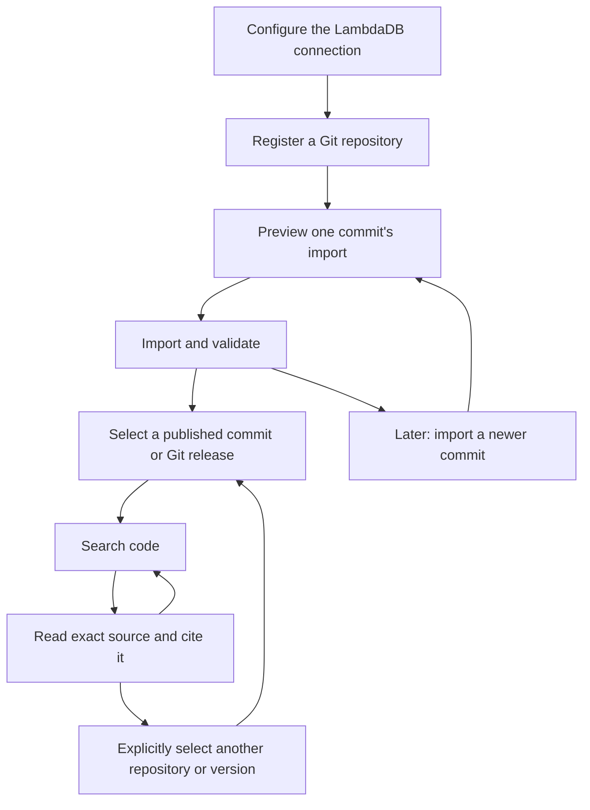

# srcx: Initial Implementation Design

Status: initial CLI implemented with local tests and live synthetic A/B validation
on LambdaDB. See [README.md](README.md) for runnable interfaces and
[VALIDATION.md](VALIDATION.md) for the bounded live evidence and remaining scope.

Updated: 2026-09-25.

## 1. Purpose, decisions, and implementation defaults

Build an independent code-search application on LambdaDB. A user selects
an exact repository version, searches its code, and reads the original source
supporting each result. The project name is `srcx`.

### Project identity

| Surface | Name |
| --- | --- |
| Project and display name | `srcx` |
| Local directory | `srcx` |
| Intended GitHub repository | `lambdadb/srcx` |
| CLI executable | `srcx` |
| Intended npm package | `@functional-systems/srcx` |
| Short description | Version-aware code search on LambdaDB |

The name is selected; the GitHub repository and npm package have not been created
or published in this project. The package manifest and executable entry point are
present in the initial CLI. Keep display/configuration naming centralized and
distribution identity in `package.json`. Database IDs and the existing
`code-*` Collection naming and `purpose=code-search-v1` protocol marker remain
independent of the product name.

Confirmed boundaries from the discussion:

- Start with a local CLI and two explicitly selected commits, not full history.
- Read committed Git tree/blob objects, never a changing working tree.
- Use one code Collection per repository by default, with fixed index settings.
- Derive repository names from Git remotes rather than arbitrary user aliases.
- Map a Git commit to a validated immutable LambdaDB Tag.
- Map each Git tag to a LambdaDB Alias targeting its published commit Tag.
  Multiple Git tags for the same commit share one commit Tag and Snapshot.
- Keep search results and subsequent source reads pinned to the selected version.
- Replace a changed file's entire chunk set initially; cache embeddings by input.
- Keep core LambdaDB work, GitHub App/webhooks, UI, MCP, and a public SaaS outside
  the first deliverable. sbrain reference documents remain unchanged.
- No remote repository creation, application commit, push, publication, real
  source upload, or paid embedding call is authorized by writing this design.

Current recommendations, distinguished from user-confirmed choices:

| Area | Initial recommendation |
| --- | --- |
| Runtime | TypeScript and a supported Node.js release compatible with the existing SDK |
| Database | LambdaDB only; no public backend selection or interchangeable database framework |
| API key | Read `LAMBDADB_API_KEY` by default; optional environment-variable-name override |
| Syntax | Java and TypeScript/JavaScript first; other text uses recorded fallback |
| Source | Exact UTF-8 source inside file documents, with local blob cache |
| File size | Start with a 1 MiB raw-source limit and explicit exclusions |
| Embedding | A fixed `none` preset first; with a model, embed meaningful code and prose chunks while recording policy-based skips |
| Discovery | LambdaDB is authoritative for repositories and published versions |
| Local state | Connection settings, checkout attachments, reproducible build artifacts, caches, and retry journals |

These recommendations supersede earlier proposals for `--backend local` and a
local-only repository/version registry. Keep offline build verification and test
doubles internal; they are not a second supported database product. Later database
comparisons can consume the same exported corpus and queries in a separate harness.

The founder confirmed deployment of the latest LambdaDB including versioning.
This document is not a deployed-revision audit or evidence of a passing live run.

## 2. User journey and example commands

The initial command set below is implemented; run it as `node dist/cli.js` from
this checkout after `npm run build`. See README for exact options and recovery.
The first implementation uses fresh `work-*` Branches and observed-local-tag Alias
synchronization; persistent tracked branches and authoritative pruning remain
follow-up work. Immutable manifest `requestedRef` is normalized to the resolved
commit OID; the
original user spelling remains in the local build artifact. The broader contract
below remains the target design.



```sh
# The API key is already supplied in LAMBDADB_API_KEY by the shell/secret manager.
srcx configure --endpoint https://api.lambdadb.ai --project engineering-search
srcx doctor
srcx repo add --path /path/to/lambdadb
srcx repo list
srcx repo show --repo lambdadb
srcx import --repo lambdadb --ref main --dry-run
# Pin exactly the commit shown by the preview.
srcx import --repo lambdadb --ref <full-commit-sha>
srcx versions --repo lambdadb
srcx search --repo lambdadb --version <published-version-id> --query consistentRead
srcx read --result <result-id> --context 20
srcx read --result <result-id> --full-file
# Read a known path without first searching.
srcx read --repo lambdadb --version <published-version-id> \
  --path src/RetryPolicy.java --lines 40:90
```

`--context` expands a result's source range; `--full-file` reads its whole parent
file. Direct path reads resolve the file within the specified immutable version.
Line ranges are one-based and inclusive. All three forms preserve the same version
and content-hash checks; they never substitute a local working-tree file.

The first demonstration prepares A, searches and reads A, prepares B with added,
changed, and deleted files, searches B, and reopens an old A result. A result never
silently changes to a newer source version. Initial lexical search is useful for
identifiers and text; semantic/hybrid relevance needs a separately evaluated model.

Users select familiar repository names, commits, and Git releases. Collection,
Branch, and Tag creation happens behind these actions. A version that has never
been imported is `not indexed`; preparation is `preparing` or `verifying`; only
successful publication is `available`. Failed attempts do not replace a usable
version. Exclusions and parser fallbacks remain visible in the coverage report.

If Git main is at B but only A is published, show requested B and available A
separately. Using A is an explicit choice, such as "latest available indexed
version". For repository-to-repository investigations, pin each selection
independently. No automatic cross-repository ranking or session service is needed.

## 3. Connection configuration

`configure` saves an existing LambdaDB endpoint/project, the credential reference,
and the default fixed index preset. It does not create a project or Collection.
The example endpoint above must match the actual project's origin.

`--api-key-env` is optional and defaults to `LAMBDADB_API_KEY`:

```sh
srcx configure --endpoint https://api.lambdadb.ai --project engineering-search \
  --api-key-env TEAM_SEARCH_API_KEY
```

Store the environment-variable name, never its secret value. A configuration file
can be saved before a key is present. Connected commands must fail clearly if the
selected key is unavailable. There is no implicit fallback to a different key.

Use one connection configuration initially. Keep the application's OS/XDG config
and state directories separate from the general LambdaDB CLI, while reusing its
endpoint validation, optional key-variable override, and atomic-write conventions.
Do not load secrets from checked-in repository files. Keep paths, display name,
and executable naming centralized; branding changes must not change data IDs.

`doctor` reads the project's Collection list to check authentication and read
access. This does not establish write permission or query readiness. Check those
through the actual provisioning/import operations. A nonexistent project is an
error; project creation stays in the LambdaDB Console for the first CLI.

Changing the configured project changes the remote discovery scope. Checkout
attachments, result handles, and retry journals include endpoint/project/Collection
identity and must never be silently reused against a different destination.
Credential rotation does not change repository or index identity.

## 4. Repository identity, provisioning, and remote discovery

### Repository names

`repo add --path ...` reads `origin` by default; `--remote upstream` selects another
remote. Normalize supported SSH and HTTPS URLs to a canonical key such as
`github.com/lambdadb/lambdadb`. Strip credentials and transport suffixes. Respect
host-specific path case; do not merge unrelated Git hosts or SSH aliases by guess.
If origin is absent but other remotes exist, require explicit remote selection.

A short name such as `lambdadb` is accepted only if unique in the connected project.
Otherwise use `owner/repo` or `host/owner/repo`. Forks remain separate repositories.
No arbitrary user alias is required. If no remote exists, use the directory's
basename for display and a persistent generated source identity, clearly labeled
as a local source. This case supports synthetic fixtures as well as local repos.

Repository and index IDs are persisted opaque identities. Explicit reconciliation
of a renamed/moved remote can retain them; source similarity alone cannot merge
registrations. Local checkout paths are attachments, not repository identity.

### Collection naming and ownership

One fixed-config index uses one Collection. The proposed name is:

```text
code-{repo-slug}-{digest}
repo-slug = lowercase ASCII letters/digits/hyphens, max 24 characters
            (collapse separators; use "repo" if empty)
digest    = first 16 hex characters of SHA-256 of the versioned canonical tuple
            (initial canonical repository key, configHash)
```

Example: `code-lambdadb-7a9c13e024b85d6f`, with an illustrative digest. Maximum
length is 46 characters. Persist the generated name; do not rename resources when
the repository or application branding changes. Verify full identity on collisions.
A new configuration requires an explicitly separate index, not silent migration.

Use Collection description and metadata labels to make the resource understandable
in both the Console and CLI. The inspected contract allows a description of up to
255 characters and at most five metadata labels. These labels are distinct from
immutable version Tags and are not version provenance or a readiness signal.

| Surface | Contents | Ownership |
| --- | --- | --- |
| `description` | Human explanation of the repository and this index's purpose/scope | Generated default, optionally supplied by the user |
| `purpose` label | `code-search-v1` | Application discovery marker |
| `repository` label | `github.com/lambdadb/lambdadb`, when it fits | Human-readable source identity hint |
| `index-id` label | Stable opaque index ID | Application binding |
| `config-hash` label | Full fixed-configuration hash | Configuration compatibility |
| One optional label | For example `team=search` | User operational context |

Example metadata (ID/hash values are illustrative):

```json
{
  "description": "LambdaDB server code index for API contract and implementation investigations. Includes source, tests, docs, and build configuration.",
  "tags": {
    "purpose": "code-search-v1",
    "repository": "github.com/lambdadb/lambdadb",
    "index-id": "example-index-id",
    "config-hash": "0123456789abcdef0123456789abcdef0123456789abcdef0123456789abcdef",
    "team": "search"
  }
}
```

Four label slots are reserved; leave the fifth unused unless context is supplied.
Store repo ID, full repository key, and complete settings in `__repo__` rather than
duplicating all machine identities in the limited label slots. The name prefix and
repository label are display hints; always validate full identity via the descriptor.

The inspected SDK limits label values to 127 characters and disallows colon, hash,
and comma characters. Use `host/owner/repo`, not an `https://` URL. If a full key
does not fit, use a visibly encoded `repo-<full-sha256>` hint in the label and retain
the unabridged key in `__repo__`; never truncate it into a false repository identity.

Allow optional `repo add --description ...` and `--tag team=search` at creation,
with reserved-key and size checks. Without supplied context, derive a short factual
description from the Git identity and selected scope. Do not invent the repository's
business purpose from its name or fetch external descriptions implicitly.
Repeated registration/import preserves existing descriptions and user labels;
changing context later is an explicit metadata edit. Descriptions and user labels
are mutable Collection context, excluded from the immutable index config hash.
Per-commit facts and exclusions remain in each published Tag's manifest.

### Branch layout within each repository Collection

```text
Collection code-<repo>-<digest>
  Branch main                 application control documents only
  Branch checkpoint-empty     preserved empty source for clean code workspaces
  Branch git-<ref-digest>      mutable corpus for one tracked Git branch
  Branch work-<id>             explicit-commit imports or recovery workspace
  Tag try-<candidate-id>       unverified immutable candidate
  Tag ver-<commit-digest>      published immutable commit version
  Alias rel-<git-tag-digest>   Git release name -> published commit Tag
```

This is an application convention, not a LambdaDB feature. LambdaDB `main` is
reserved here for control data; Git main maps to an encoded `git-*` Branch. Create
`checkpoint-empty` before writing any control documents to main. Code workspaces
start from that empty Branch or a validated suitable code Branch, never from
control-data main. No Branch is created from a Tag.

Control records use `kind=manifest` with distinct roles. On main, fixed ID
`__repo__` stores full canonical repository identity, original/display names,
repo/index IDs, exact immutable index configuration, schema version, and an
initialization marker. Ref records store original Git names, encoded Branch/Alias
names, observed commit and observation time, and applied target. They contain no
machine-specific checkout paths or secrets. Required publication validation
summaries are retained here, separately from immutable corpus manifests.

### `repo add` sequence and retries

1. Resolve the local Git identity and selected index configuration.
2. List/describe matching application Collections in the configured project.
   If an initialized compatible repository exists, reuse its IDs and attach the
   local checkout; a fresh machine must not create a duplicate repository.
3. Otherwise persist a provisioning journal, then create the Collection with the
   fixed schema, readable description, and reserved/optional labels. LambdaDB
   supplies default main.
4. Create `checkpoint-empty` from still-empty main and confirm its empty head.
5. Upsert `__repo__` onto main using ordinary document upsert. Fetch it back with
   an explicit Branch ref and `consistentRead=true`; compare the exact descriptor.
6. Mark the local provisioning attempt complete and report `registered`, with
   zero published versions until the first import. No source contents are uploaded
   and no embedding provider is called by this command.

A missing descriptor after Collection creation is `initializing`, not a nonexistent
repository. Reconcile labels, schema, journal, and Branch state on retry; never
blindly repeat an uncertain create or delete the Collection as rollback. Fail on
mismatched identity/configuration or an unrelated same-name Collection. Existing
remote registration can be recovered without local state, but an incomplete or
inconsistent registration must be explicitly diagnosed and repaired.

Control Branch readback confirms that control data is observable, not that corpus
Snapshots are ready. Handle the actual API's transient/overlay limits with bounded
retries; do not use a control record as an import readiness signal.

### `repo list` and `repo show`

These commands use the connected project, not a local repository registry:

- Enumerate all Collection pages and select application ownership labels client-side.
  The inspected list API has pagination but no assumed server-side metadata filter.
- Fetch `__repo__` from each matching Collection's main Branch to recover full names
  and configuration. Do not parse a hashed Collection name into a Git identity.
- Show Collection name, full repository identity, description, index preset, and
  initialization status. `repo show` also describes labels, actual schema, and
  available refs. Preserve user context when reconciling registrations.
- Local checkout attachment is optional enrichment. Reading/searching remote data
  works without a checkout; another import needs an attached clone or `--path`.
- If LambdaDB is unavailable, report that; do not silently present a stale local
  cache as current remote state. A cached view, if added later, must be explicit.

Do not use Collection `numDocs` as the source corpus count: it describes main,
which holds control records under this layout. Use the selected code manifest.
Multiple experimental indexes for a repository are displayed separately; ambiguity
must require an explicit index selection before operations, never an arbitrary pick.

## 5. What `import --ref` accepts

Accept branch names, explicit branch refs, Git tag names/refs, and commit OIDs:

```sh
srcx import --repo lambdadb --ref main
srcx import --repo lambdadb --ref refs/heads/main
srcx import --repo lambdadb --ref refs/tags/v1.0.0
srcx import --repo lambdadb --ref <full-commit-sha>
```

A short Git tag such as `v1.0.0` is accepted if unambiguous. If a branch and tag
share a name, require a qualified ref. An abbreviated commit is acceptable only
if unambiguous locally; persist the full resolved OID. Peel annotated tags to
commits, reject non-commit objects, and do not assume all object IDs have 40 digits.
General revision-expression support is not required initially.

Resolve once at the start and use only that commit thereafter. Use the attached
clone's declared ref view; a local main is not automatically remote origin/main.
No implicit fetch, checkout, LFS smudge, build-script execution, or working-tree
read is part of import. Report the selected ref and full commit before processing.

Dry-run and import are separate resolutions. To import exactly the previewed
source, pass its full SHA. A branch-name import tracks that explicit branch;
a commit/tag import uses a manual workspace without guessing a containing branch.

## 6. File-by-file build and bounded upload

Git reading/chunking belongs to this application. Use the official SDK for database
calls. Start with a single process, bounded parsing concurrency, and serialized
writes per repository Collection. Multi-host concurrent import is not supported;
readers on multiple machines do not require local registration state.

### Phase A: plan and materialize before any corpus mutation

1. Resolve remote repository descriptor and exact config; attach/verify the clone.
   Refuse configuration mismatch before writes. Reuse an existing published commit
   only after checking its manifest identity.
2. Resolve the target commit. Select the known validated previous corpus for the
   intended writer Branch, or an empty baseline. Enumerate with NUL-delimited
   `git ls-tree -r -z`; use `git cat-file --batch-check` and `--batch` for size/blob
   reads. Disable replacement-object interpretation; missing objects are errors.
3. Compare target path/blob/mode entries to the previous inventory. Classify each
   path as unchanged, added, modified, deleted, or explicitly excluded. Initially
   treat a rename as delete plus add; the two commits need not be adjacent.
4. For each added/modified included file: read exact bytes, verify UTF-8 round-trip,
   compute content hash, parse, derive complete source spans, form bounded chunks,
   create one file record and its chunk records, and prepare embedding inputs.
5. For unchanged files, retain file/chunk records and metadata verbatim. For each
   changed/deleted file, compute obsolete IDs as previous file/chunk IDs minus
   replacement IDs. A deleted file has an empty replacement set. Obtain previous
   IDs from the inventory, not mutable query-by-path results.
6. Apply the pinned per-chunk embedding policy. If embeddings are enabled, batch
   eligible cache misses across chunks/files within the provider's token/request
   limits. Validate successful vectors before caching.
   Bound queue memory; do not load an entire repository's content into RAM.
7. Materialize deterministic records and deletion lists as local build artifacts.
   Produce size-bounded inventory parts and a root manifest template. Check all
   serialized sizes and record-set hashes before starting uploads. The execution
   journal supplies the separate attempt ID when sealing the final manifest.

Dry-run executes the same inventory/chunking path but performs no database mutation
or embedding call. For pending embedding misses, report tokens and projected vector
size separately; do not claim a completed vector/records hash. Report every entry,
exclusion reason, parse status, byte size, chunk/token counts, embedding eligibility
and skip reasons, and change summary. Dry-run plans may show pending embedding work;
published chunk records may not silently treat missing required vectors as skips.
Fixture-only dry-run can use `--path` and the built-in pinned preset without any
connection or remote repository lookup. No `--backend` option is needed for that.

### Phase B: apply the build to one code Branch

1. Establish the correct Branch baseline, acquire exclusive writer ownership, and
   persist a mutation journal with this attempt's ID.
2. Delete obsolete IDs in bounded batches, then upsert replacement file/chunk
   records in batches bounded by serialized bytes and document count. Await each
   request before issuing the next. Batches can span files; no per-file transaction
   is assumed. Unchanged records need no write; changed positions are updated.
3. Replace obsolete inventory parts. Record accepted/rejected/unknown outcomes for
   every mutation, with transparent retries disabled. Resolve all failures and
   unknown outcomes before proceeding; ACK is not yet indexing completion.
4. After all preceding mutations have successful ACKs, upsert `__manifest__` alone
   in a separate final request, with the intended build identity and this attempt's
   ID. Do not rely on its position inside a multi-document request.
5. Freeze further writes to this code Branch, wait for the marker, then create and
   validate a candidate as described in section 9. Do not start another commit
   until publication completes. A partial Branch is never served to users.

Use ordinary SDK upsert/delete for this workaround. Bulk ingestion remains later
work; do not assume its asynchronous processing obeys the same marker ordering.

### Replacing one file

Replace a modified file's chunk set as a unit in the build plan, using the previous
inventory's explicit IDs for deletion. This makes retry targets fixed and removes
obsolete chunks when the new file produces fewer chunks. Retain any IDs shared by
the old and new sets. The default is ID deletion, not delete-by-filter.

If a filter-based replacement is introduced later, restrict chunk deletion to
`kind=chunk` and the previous `fileId`, and delete the old file record by ID.
Avoid path-only deletion: replaying it after upsert can delete the new file's
records too. Neither deletion method makes delete-plus-upsert atomic. Readers stay
on the previous published Tag until the replacement version passes validation.

Source collection and batching are distinct. A 20-chunk file contributes one file
record and 20 chunk records; these can share upload requests with other files.
Original text appears once in its file record, with exact source ranges in chunks.
Search context can repeat in chunk search text without changing the quoted source.

## 7. Code-search schema v1

The Collection uses one sparse document schema with `kind` distinguishing file,
chunk, and manifest records. Only chunks participate in normal search. Manifest
roles distinguish corpus metadata/inventory from main-Branch control documents.

The lexical preset's concrete `indexConfigs` is:

```json
{
  "kind": { "type": "keyword" },
  "path": { "type": "keyword" },
  "language": { "type": "keyword" },
  "fileId": { "type": "keyword" },
  "symbol": { "type": "keyword" },
  "searchText": { "type": "text", "analyzers": ["standard"] }
}
```

LambdaDB returns an additional built-in `id: keyword` index in Collection metadata;
compatibility checks allow that field without accepting other schema changes.
Only fields used by initial search/filter operations are explicitly configured. Byte/line
positions, hashes, commit identity, and control roles are stored for source reads
and validation, not indexed merely because they appear in the payload. Resolve
control documents by ID and inventory parts through the root manifest. Collection
`description` and metadata `tags` describe the resource; they are not document
fields or versioning Tags.

### Document payload contract

Every record stores `id`, `kind`, `schemaVersion`, and `configHash`. The following
fields are additional payload, not additional `indexConfigs` entries. Optional
fields are omitted when absent; records of different kinds need not share them.

| Record | Additional stored fields |
| --- | --- |
| File (`kind=file`) | `path`, `blobOid`, `contentHash`, `byteLength`, `sourceText`, `language`, `parseStatus`, `chunkCount` |
| Chunk (`kind=chunk`) | `fileId`, `path`, parent `contentHash`, `language`, `chunkKind`, `startByte`, `endByte`, `startLine`, `endLine`, `ordinal`, `searchText`, `embeddingStatus`; optional `symbol`, `scope`, `signature`, `embeddingSkipReason`, `embeddingInputHash`, `embedding` |
| Corpus root (`kind=manifest`, `role=corpus`, ID `__manifest__`) | `repoId`, `indexId`, full `commitOid`, `commitTime`, `requestedRef`, full `config`, `inventoryHash`, `recordsHash`, `counts`, `buildId`, `attemptId`, `inventoryPartIds` |
| Inventory part (`kind=manifest`, `role=inventory`) | `partOrdinal`, `partHash`, ordered `entries` with path, file/chunk IDs, blob/content identities, inclusion/exclusion reasons, parse states, sizes, and embedding coverage |
| Repository control (`kind=manifest`, `role=repository`, main ID `__repo__`) | Full source identity, repo/index IDs, immutable preset/config, initialization state |
| Ref control (`kind=manifest`, `role=git-ref`, main) | Full Git ref name, encoded Alias/Branch name, observed commit/time, applied version and synchronization state |
| Validation summary (`kind=manifest`, `role=validation`, main) | Candidate name/Snapshot, build/config/attempt identity, verifier version and checked counts/hashes; no premature claim of publication |

`startByte`/`endByte` are half-open; display lines are one-based/inclusive.
`contentHash` on a chunk refers to its parent file's bytes. `chunkKind` describes
content such as function, declaration, documentation, imports, or fallback; it is
separate from the file/chunk/manifest discriminator. `counts` includes included and
excluded files, chunks, and embedded/skipped chunks with reason totals.

In a completed corpus, `embeddingStatus=embedded` requires a valid vector and
`embeddingInputHash`, and omits the skip reason. `embeddingStatus=skipped` requires
an explicit policy reason and omits the vector and input hash. The lexical-only
preset records `embedding-disabled`; an embedding-enabled preset records its
specific exclusion reason. Pending or failed required embedding work stays in the
local journal and blocks publication, rather than becoming an undocumented skip.

Illustrative upsert payload for a file containing one import line. ID/hash strings
are placeholders; the UTF-8 byte length and source span are concrete:

```json
{
  "docs": [
    {
      "id": "file-example",
      "kind": "file",
      "schemaVersion": 1,
      "configHash": "example-config-hash",
      "path": "src/Example.java",
      "blobOid": "example-git-blob-oid",
      "contentHash": "example-source-hash",
      "byteLength": 21,
      "sourceText": "import java.io.File;\n",
      "language": "java",
      "parseStatus": "parsed",
      "chunkCount": 1
    },
    {
      "id": "chunk-example",
      "kind": "chunk",
      "schemaVersion": 1,
      "configHash": "example-config-hash",
      "fileId": "file-example",
      "path": "src/Example.java",
      "contentHash": "example-source-hash",
      "language": "java",
      "chunkKind": "imports",
      "startByte": 0,
      "endByte": 21,
      "startLine": 1,
      "endLine": 1,
      "ordinal": 0,
      "searchText": "src/Example.java\nimport java.io.File;\n",
      "embeddingStatus": "skipped",
      "embeddingSkipReason": "imports-only"
    }
  ]
}
```

This example uses an embedding-enabled preset that skips imports-only chunks. The
actual request must also target the intended writable Branch. The complete source
is stored in the file; enriched chunk search text is never the citation authority.

`sourceText`, role, byte/line positions, hashes, commit identity, scope/signature,
embedding diagnostics, and inventory/config objects are stored without entries in
`indexConfigs`. Public documentation states that fields are stored even when not
indexed. Do not invent an `index: false` option. The `standard` analyzer is a
baseline, not a proven code-specific ranking solution. An initial enrichment
candidate preserves original identifiers while adding camelCase/snake_case terms;
pin and evaluate that transformation before adopting it as the preset.

An embedding-enabled preset adds an unmanaged `embedding` vector field with a
concrete model-selected dimension and similarity metric, fixed before Collection
creation. An indexed vector field does not require a vector on every chunk; file
and manifest records also omit it. The `none` preset omits the vector index entirely.
Changing presets creates a separate index; do not silently mutate an existing
serving index. Do not write placeholder or test vectors into a real corpus.

All code-search queries require `kind=chunk` and an explicit published Tag. File reads
fetch a parent file by ID through that same Tag and check its content hash. A
result includes endpoint/project/Collection, repo/index, full commit, published
Tag/Snapshot, file ID, path, and source range. Handles carry or persist enough
version-bound data to reproduce a read; no current-branch substitution is allowed.

### Deterministic identities and limits

- `contentHash`: SHA-256 of original bytes, separate from Git object hashing.
- File ID: hash of a versioned `(path, contentHash)` tuple.
- Chunk ID: hash of `(fileId, configHash, startByte, endByte, ordinal)`.
- Config hash: canonical schema/policy/parser/grammar/chunker/tokenizer/enrichment
  and embedding configuration, including per-chunk eligibility rules, with pinned
  versions.
- Build ID: hash of `(repoId, commitOid, configHash, builderIdentity)`.
- Attempt ID: unique execution identity, persisted in the journal and final root
  manifest. A new import attempt gets a new ID even for the same build; resuming
  that journal preserves its ID. It is not an embedding-cache or content identity.
- Inventory hash: canonical complete ordered inventory. Store large inventories
  in bounded parts; include their source and chunk membership identities.
- Records hash: canonical expected file/chunk records, excluding manifests to
  avoid circular hashing. Validate vectors against the serialized input contract.

No brand, new commit SHA, build ID, or attempt ID is stamped onto unchanged
file/chunk records. The selected manifest supplies the citable commit; content
identity and spans supply the source.
Keep timestamps and attempt IDs outside deterministic content identities.

The inspected public limits are 5 MB per document, 6 MB per upsert request, ID
length 512, and vector dimension at most 4,096. Inspected server source counts
serialized JSON bytes, with a 5 MiB document limit. Validate final UTF-8 JSON size,
including escaping and vectors; batch with headroom. This source checkout is a
feature branch, not proof of the exact deployed artifact. Full live verification
must include stored-only source round-trip and mixed record kinds.

## 8. File policy, chunking, and embedding reuse

Every Git tree entry must be accounted for. Include source, tests, documents,
configuration, build definitions, and unknown readable text by default. Maintain
explicit versioned rules for binaries, generated output, and vendored dependencies;
do not treat working-tree ignore rules as a complete policy. Lockfiles are included
unless an explicit generated/size rule excludes them.

| Special entry | Initial handling |
| --- | --- |
| Submodule | Record gitlink OID/path; no recursive import |
| LFS pointer | Record metadata; no payload download or pointer indexing |
| Symlink | Record target bytes; never follow or index as source |
| Oversized file | Exclude with actual bytes and configured limit |
| Invalid UTF-8 content/path | Record a diagnostic and lossless path identity; do not decode lossily |
| Empty text file | File record, zero chunks |
| Unsupported language or parse failure | Include bounded fallback chunks and distinguish the reason |

Preserve raw UTF-8 bytes, BOM, CRLF, case, Unicode, and final newlines. Byte ranges
are authoritative `[startByte, endByte)`; display lines are one-based/inclusive.
JavaScript UTF-16 offsets must be converted explicitly. Preserve unusual Git paths
via NUL-delimited parsing and safe subprocess arguments; never shell-interpolate refs.

### Approach and supporting evidence

Use a syntax-aware split/merge implementation as the initial code chunker, with
Tree-sitter as the parser candidate. Tree-sitter supplies syntax nodes and source
positions; chunk sizing, comment attachment, gap coverage, and merging remain
application policies. Inspect the chosen binding and grammar versions before
adoption, especially byte offsets versus JavaScript string offsets.

Existing approaches provide a starting point rather than a universal standard:

- [LlamaIndex CodeSplitter](https://developers.llamaindex.ai/python/framework-api-reference/node_parsers/code/)
  provides an existing AST-based splitting implementation to inspect. Treat it as
  a reference, not a requirement to add the Python framework to this TypeScript
  application. Check the selected source revision, actual parameter behavior,
  source-span preservation, and license before reusing implementation details.
- [cAST](https://arxiv.org/abs/2506.15655v2) describes recursively splitting large
  syntax nodes and merging sibling nodes within a size budget. This supports the
  design direction, but srcx does not claim to reproduce that algorithm or its
  reported benchmark results.
- A [controlled code-completion study](https://arxiv.org/abs/2605.04763v1) reports
  competitive sliding-window and cAST results and weaker function-only results in
  its evaluated settings. Code completion is not the same task as srcx's source
  investigation; do not assume syntax-aware chunks always retrieve better.

Start implementation after a bounded review of these approaches. Selecting a
binding and verifying correctness are immediate work; inventing a new algorithm
or reproducing all published benchmarks is not a prerequisite. The default below
preserves useful syntax boundaries while allowing both splitting and merging; it
is not an unconditional one-function-per-chunk rule.

### Initial boundary and size rules

Prefer functions/methods and split large nodes along internal statement boundaries.
Cover class headers, imports, types, fields, constants, top-level code, comments,
punctuation, and gaps. Merge small adjacent units only within one scope and budget.
If a node or long line is still too large, text-split it and record the fallback.
Initially an unusable/error parse falls back for the whole file. Markdown uses
headings/paragraphs/fences; structured config uses position-preserving keys/sections
where supported, otherwise recorded text fallback.

Start at a 500–1,000 token target, 1,500 ceiling, no syntax overlap, and about 10%
fallback overlap. These are experiments, not optimal values. Keep small units small.
Pin the tokenizer and count the entire enriched embedding input against its budget
and the model limit. Cap path/scope/signature enrichment before splitting source.

Coverage checks use the union of source spans over all included bytes, allowing
only declared overlap. Attach whitespace gaps to neighboring spans; whitespace-only
files still receive bounded spans. Do not concatenate overlapping chunks to rebuild
source. Retrieval enrichment never expands the quoted raw source range.

### Small chunking comparison

Keep one simple line-boundary, token-budget window splitter as an internal
comparison baseline. It may reuse the bounded text fallback implementation.
Record its size and overlap explicitly; retain the same source-span contract.
This comparison does not add a public chunker-selection interface or another
storage backend.

First verify correctness for both paths: complete included-byte coverage, exact
UTF-8/line spans, bounded enriched inputs, deterministic output, and visible parse
fallbacks. Include large functions, small declarations, attached comments,
Unicode/CRLF, and long lines. These checks can run on local fixtures before any
credentials, source upload, or embedding calls are needed.

Once retrieval is available, compare the syntax-aware default and the simple
baseline using 10-20 real investigation queries. Include exact identifiers,
behavior described in natural language, configuration/documentation lookups, and
version-specific changes. Pin repository commits and label expected files,
symbols, and source spans before examining either method's results; do not define
relevance by one chunker's boundaries. Treat this as a diagnostic pilot, not a
statistically general benchmark.

Hold corpus inclusion, tokenizer, enrichment rules, retrieval settings, and (when
used) embedding model and eligibility policy constant. Give each chunker its own
config identity and separate evaluation index/artifacts. Vary chunking first;
evaluate embedding coverage policies in a separate comparison. Document any
content-classification differences that make eligibility incomparable.

Record per-query results and summarize:

- Expected evidence found in the top 5 results, plus evidence coverage under a
  fixed returned-token budget shared by both methods. Match original source spans
  and deduplicate overlapping hits so small or overlapping chunks do not inflate
  the score. Choose and record the token budget before running the comparison.
- Tokens actually returned, duplicate/overlapping context, and whether a result
  cuts off source needed to understand the behavior. Count any context expansion
  under the same policy and budget for both methods.
- Corpus chunk count and enriched token volume; actual embedding input tokens
  and measured provider cost only if an authorized embedding run occurred.

Keep the syntax-aware default provisional until this pilot is run. Investigate
misses before changing size, overlap, comment attachment, or path/scope enrichment;
record the reason for each adjustment rather than running a broad parameter sweep.
Validate adjustments on fresh queries before making wider quality claims. The
pilot tunes retrieval quality after the minimal pipeline works; it does not block
bootstrap or replace the two-commit correctness completion criterion.

### Per-chunk embedding policy

With an embedding-enabled preset, meaningful pure code remains eligible even when
it has no comments: users may describe behavior without knowing its identifiers.
The initial recommendation is to include useful code and prose and skip clearly
structural fragments, rather than build a complex value classifier.

| Chunk content | Initial recommendation |
| --- | --- |
| Functions, methods, meaningful top-level logic | Embed, including uncommented code |
| Tests | Embed usage examples and expected behavior |
| Documentation, explanatory comments/docstrings | Embed; keep attached explanations with their code where practical |
| Meaningful type/configuration declarations | Embed initially, then evaluate |
| Imports-only or whitespace/punctuation-only fragments | Skip with a recorded reason |
| Repeated license headers and mechanical listings | Candidates for explicit, versioned skip rules after evaluation |
| Parser fallback | Do not exclude solely because parsing failed; apply content policy |

Skipped chunks remain in inventory and source coverage. Retain lexical search text
where meaningful; a chunk without a vector cannot contribute a vector candidate.
Search must retain lexical candidates when combining lexical and vector results.
Keep the query/document embedding spaces compatible across code and prose; do not
mix separate models' vectors merely because their dimensions happen to match.

Record eligibility policy in configHash and count embedded/skipped chunks in the
manifest. Compare lexical-only, prose-only embedding, and code-plus-prose embedding
on the same corpus and queries before claiming a quality or cost benefit. Model
choice and the finer skip rules remain evaluation decisions, not measured results.

### Embedding reuse

Cache embeddings by the exact full input and provider/model/revision/dimensions/
preprocessing settings. Do not include commit, line numbers, file IDs, or build IDs
in that input. A line shift can update positions while reusing the same vector;
changed chunk boundaries or a renamed path in the input can legitimately miss.
Cache only successful validated outputs atomically. Query embeddings use the same
compatible contract and have their own cache/budget accounting. Provider aliases
may drift if no immutable model revision exists; record that limitation.

## 9. Candidate validation, publication, and `versions`

### Why candidate and published Tags are separate

A raw Tag proves Snapshot immutability, not completed ingestion. Local validation
state alone is insufficient when a fresh CLI installation must list usable versions.
Use two application naming namespaces under the inspected ref-name limits:

- `try-<candidate-id>`: candidate. Hidden from normal `versions`; available under
  `versions --all` as unverified/failed/abandoned where evidence exists.
- `ver-<commit-digest>`: published. Use a deterministic bounded digest of the full
  commit OID within this fixed-config Collection; verify full identity on collision.

Publication is a protocol enforced by the importer, not a server-provided status.
Manual or foreign resources that violate it are reported as inconsistent.

### Temporary completion marker for committed indexing

On September 24-25, the user confirmed that current Tag creation selects the latest
indexed Snapshot even after write ACK, and reported indexing in acknowledged write
order. Work to snapshot WAL plus indexed data is in progress; this design does not
assume that future behavior is deployed.

Use the final root manifest as the completion marker for ordinary upsert/delete.
The ordering premise is that a committed Snapshot exposing this marker contains
all preceding acknowledged mutations, including deletes, across the corpus. This
is user-reported behavior, not a live verification performed in this project.
Verify that premise with the live fixture, including deletes and all affected
partitions/indexes; do not infer it solely from a marker in one document.

After all data and inventory mutations have successful ACKs, write `__manifest__`
as a separate final request (section 6). Fetch it by ID from the same code Branch
with explicit `consistentRead=false`, using bounded backoff/deadline. Match this
attemptId, buildId, commitOid, configHash, and expected hashes, not merely document
existence. A previous attempt's marker for the same commit cannot satisfy the wait.
The stable build ID and unique attempt ID have different purposes.

Hold exclusive writer ownership through Tag validation and publication. Do not
write the next commit or mutate source records after the marker. Starting B before
A is captured could produce a Snapshot containing both phases without a usable
A-only state. Do not use `consistentRead=true`, an ACK timestamp with `asOf`, a fixed
sleep, or a Branch head change alone as completion proof.

The marker is an ordering check, not evidence that the importer generated correct
records. Keep candidate content validation below. If the ordering premise is not
established, marker polling remains only a hint and full immutable-candidate
validation decides correctness. Timeouts leave a resumable, unpublished attempt;
they do not authorize the next commit on that workspace.

### Publication steps

1. Freeze code-Branch writes after the final manifest ACK and wait for its matching
   marker as above. Reject unresolved write or required embedding failures.
2. Create a unique candidate Tag from that Branch and record its Snapshot ID and
   originating attemptId. Each probe uses a fresh candidate ID under ref-name limits.
3. Read the root manifest through that exact Tag and require the same attempt and
   build identity. A Branch read may precede Tag metadata propagation; a mismatch
   cannot be published. Then compare complete file/chunk ID sets, inventory parts,
   deletions, actual content/record hashes, byte/line spans, embedding eligibility
   and vector shape, and representative query/read results. Recompute hashes from
   the actual records, paging through the complete immutable corpus; a declared
   manifest hash or count equality is insufficient.
4. Persist a validation summary on control main, with candidate/Snapshot/build/
   attempt identity and verifier version. Use an ID derived from the full commit
   OID and candidate Snapshot ID so attempts cannot overwrite another Snapshot's
   evidence. Confirm its readback before publication.
5. Create the deterministic published Tag **from the validated candidate Tag**,
   not from the mutable Branch. Verify both Tags have the same Snapshot ID and
   matching manifest. Publication changes naming, not corpus content.
6. Update optional branch-progress/control records and return the published version.
   A delayed bookkeeping write does not erase an already published immutable Tag.

An empty Snapshot or incomplete candidate never becomes published. A stale Tag
will not become complete by waiting; keep the Branch frozen, wait for committed
progress, and probe a fresh candidate. Head changes only trigger another check;
avoid repeatedly validating known stale Snapshot IDs. A payload/build defect
requires explicit same-build recovery, not endless polling. Publication must
finish before the same code Branch starts a later commit.

### `versions` reads LambdaDB

1. Resolve the repository Collection through remote metadata.
2. List its Tags; select the reserved published namespace for the normal view.
3. Fetch `__manifest__` through each published Tag, using bounded concurrency, and
   verify full commit/config identity and deterministic name. Recover commit and
   counts from the manifest, not by reversing a short hash in a Tag name.
4. Read the matching validation summary from control main. If it is missing or
   inconsistent, show `needs verification` rather than silently asserting validity.
   Listing checks publication evidence; it does not rerun full corpus validation.
5. List Aliases, select release mappings, and join them to published Tags. Full Git
   names come from ref-control records, not a lossy reverse mapping of Alias names.
6. Display commit, Git release names if present, publication time, coverage/counts,
   and availability. Distinguish Git commit time from Tag creation time.

Only imported/published commits are listed, not all commits or all tags in Git.
A published commit with no Git tag still appears. A Git tag pointing to an unimported
commit is pending in synchronization output, not an available search version.
Listing and source reads work without a local Git clone. Alias/ref observation
freshness is shown; this command does not claim to have polled GitHub for current refs.

If creation of a published Tag has an unknown result, list and inspect the expected
name/Snapshot/manifest before retrying. Existing valid publication is reused.
A crash after candidate validation but before publication can be recovered by
revalidating that candidate and publishing; a `try-*` name alone is never enough.

## 10. Git tags, exact version selection, and recovery

### Git release Alias synchronization

`sync-tags` reads an explicitly authoritative Git ref view. Record the original
ref, encoded Alias name, desired commit, and observation time on control main
before mutation. Create/retarget the Alias only to an already published `ver-*`
Tag. It does not import missing commits or call embeddings implicitly.

The initial ref view is the attached local clone's currently present `refs/tags/*`,
with its observation time and completeness recorded. This is not a reconstruction
of deleted tags, historical tag movements, or a claim to know all remote tags.
Peel annotated tags to commits and reject non-commit targets. Synchronizing all
observed names does not import all target commits: missing ones remain pending.

Multiple Git tags pointing to one commit create multiple Aliases targeting the
same canonical commit Tag. Import, chunking, embedding, and validation happen once
for that commit/configuration. Encode each full Git ref into a distinct bounded
Alias name and keep the original name in its control record; raw Git names need
not satisfy LambdaDB ref-name rules.

```text
Git refs/tags/v1.0.0 -> Alias rel-<ref-X-digest> --+
                                                +-> Tag ver-<commit-A-digest> -> Snapshot S
Git refs/tags/stable -> Alias rel-<ref-Y-digest> --+
```

Do not create a separate LambdaDB release Tag for every Git tag. Moving or deleting
one Git tag affects only its Alias; other Aliases and the canonical commit Tag stay
intact. Search resolves any selected Alias to that immutable commit Tag before use.

Full Git history replay is unnecessary. To index every desired release, import the
unique target commits only. Each target supplies a complete Git tree: build it from
an empty workspace or diff it against a known validated writer baseline. For
A -> B -> C -> D -> E with releases at A/C/E, B and D need no imports. Chronological
order is optional for reuse, not a correctness rule; do not assume Tag-to-Branch
creation when choosing a baseline. Import remains separate from `sync-tags`.

A moved Git tag leaves its previous Alias target until the new target is published.
If the app knows the requested Git name now points elsewhere, report pending rather
than quietly treating the stale target as current. Deletion removes only the Alias;
retention of commit Tags is separate. Do not infer deletion from a shallow/incomplete
clone or an absent fetch. Interrupted ref-control/Alias updates reconcile against
actual Alias target and recorded intent; they are not a cross-resource transaction.

`resolve --ref` returns a published version identity. Search/read then use that
immutable Tag, never a moving Alias or Branch. Tag and Alias metadata/API calls
are accessed through the SDK; Branch-from-Tag and arbitrary Snapshot reset are not
assumed. The earlier sbrain release-Tag mapping is superseded by Git tag -> Alias.

### Failures and operational boundaries

Use a single designated importing process/host initially and a local exclusive
Collection lock. Remote discovery does not imply a distributed locking protocol.
Unexpected writers or uncertain baselines block further corpus mutation. Read-only
clients may operate from multiple machines without local registry replication.

Disable transparent mutation retries. Record accepted/rejected/unknown batches.
On partial or unknown writes, freeze the affected workspace and reconcile the
journal against the same intended build. Never apply a newer commit over an
uncertain baseline. Explicit same-build upsert/delete replay is allowed only under
exclusive ownership; it is not an assumed API idempotency receipt.

If baseline recovery is impossible, preserve the failed workspace and rebuild from
Git on a fresh Branch sourced from checkpoint-empty. Validate and publish before
serving. Do not assume Branch merge/reset, Tag-to-Branch creation, or an implemented
readiness endpoint. Branch `consistentRead` is useful for small control documents,
not proof that a code Tag contains accepted mutations.

Keep bounded attempt/deadline policies and failure reports. Do not delete failed
resources as automatic rollback. Candidate cleanup and published-version retention
are explicit later operations, protecting active Alias targets and investigations.
Missing original versions fail clearly rather than substituting newer source.

## 11. Local preparation, implementation stages, and tests

The application always targets LambdaDB for shared storage and serving. For work
without credentials, implement a pure Git-to-build pipeline, exported JSONL/
inventory/deletion plans, fixture source readers, and small SDK test doubles. Keep
these behind tests or developer scripts, with no public backend selection. They
can also feed a later comparison benchmark without generalizing the product.

```sh
# Credential-free inspection of a fixture; no repository registration required.
srcx import --path /path/to/fixture --ref <commit-A> --dry-run
```

| Stage | Deliverable | Exit evidence |
| --- | --- | --- |
| 1. Bootstrap/config | English README, TypeScript package, pinned dependencies/preset, optional key override, Git identity | Config/identity fixtures pass; no secret stored |
| 2. Inventory/chunking | Pure build planner and path-based dry-run | Every entry accounted for; precise spans and bounded chunks |
| 3. Two-commit local verification | Materialized A/B artifacts, deletion plan, cache and search/read fixture harness | A/B inventories and original evidence remain correct; no remote claim |
| 4. LambdaDB integration | Remote provisioning/discovery, schema, batches, final-marker wait, candidate validation/publication, versions/search/read | SDK mocks pass; separately authorized live fixture checks actual APIs and marker ordering |
| 5. Git release names | Alias synchronization and ref-control recovery | Moves/deletions and pinned investigations behave correctly |

The first completion criterion remains: process two commits, reflect additions/
modifications/deletions, and connect each version's chunks to exact source. Report
local artifact/mock completion separately from LambdaDB live completion.

Implement the internal window baseline alongside stage 2's chunker. Run the
section 8 query comparison once a retrieval path is available, and report whether
it used local fixtures, actual lexical serving, or an authorized embedding run.
No retrieval-quality result is implied by local chunking correctness checks.

Required meaningful checks:

- Default API key variable works; override is optional; no key is saved/logged.
- Configure/doctor have no resource-creation effects. Project changes never redirect
  an old result handle or retry journal to another resource.
- SSH/HTTPS identity normalization and fork/name collisions behave correctly.
- A fresh local state directory can discover repos/versions and read evidence from
  the same project. Missing descriptors/ref records report partial initialization.
- Provisioning retries resume safely without duplicate or unrelated resource adoption.
- Dirty working files and a moving ref do not alter the initially pinned import.
- Every tree entry has inclusion/exclusion evidence; special files are not traversed.
- Byte coverage, Unicode/BOM/CRLF/trailing-newline/long-line spans are exact.
- Parse failures and huge nodes stay bounded and visible in reports.
- B contains additions/replacements/deletions while A reads remain unchanged.
- A controlled line-shift fixture updates positions and reuses identical embeddings.
- Different paths remain distinct even with identical bytes; reuse follows input.
- Fixed-config mismatches fail before writes; fake vectors never enter a real corpus.
- Explicit obsolete-ID deletion preserves replacement IDs and removes surplus chunks.
- Eligible code/prose chunks have valid vectors; policy skips remain covered and
  lexically retrievable where meaningful. Required embedding failures block publication.
- The last manifest is a separate request after every prior ACK; a stale attempt's
  marker, unresolved mutation, or `consistentRead=true` read cannot complete the wait.
- Candidate Tag readback matches the marker even if Branch and Tag observations lag.
  Verify ordered marker visibility across deletes and affected partitions/indexes live.
- A marker does not hide an intentionally corrupted/missing record from validation.
- Partial writes and stale candidates cannot appear in normal published versions.
- The final Tag has exactly the validated candidate's Snapshot, even if a Branch moves.
- Publication and Alias crash points recover without local-only version truth.
- Two Git tags for one commit create two Aliases to one commit Tag without repeated
  import/embedding; moving/deleting one leaves the other mapping intact.
- Missing release commits stay pending; importing selected nonadjacent commits does
  not require intermediate commits or historical/deleted Git tag reconstruction.
- Search filters to chunks and reads original source through the same published Tag.
  Context, whole-file, and direct path/line reads preserve that version and its spans.

Do not write tests that merely mirror implementation. Test doubles establish workflow
behavior only; actual serving, mixed schema, metadata discovery, Tag-from-Tag,
readback, and deletion visibility need a fixture live run. Paid model relevance,
latency, and operational cost are separate measurements.

## 12. Remaining decisions and inspected evidence

| Decision | When needed |
| --- | --- |
| First real repositories and parser priority | Real-repository evaluation; defaults do not block fixtures |
| Exact parser/tokenizer/preset versions, enrichment and embedding skip rules | Bootstrap and retrieval evaluation; pin before publishing a corpus |
| Chunk size/overlap and syntax-versus-window tradeoff | Section 8 pilot after retrieval works; current values are starting points |
| Embedding model/dimensions/provider, data destination, spending cap | Before any real source upload or paid experiment |
| LambdaDB endpoint/project and credentials | Provisioning and live fixture run |
| Authoritative Git-tag source and observed-ref freshness policy | Manual Alias synchronization |
| Concurrent multi-host writers, retention/cleanup, configuration migration | Later internal operation, outside first CLI |

Sources and evidence used during this design discussion:

- September 24-25 user discussion: current ACK/Tag timing, acknowledged-write
  indexing order, and ongoing WAL-plus-indexed Snapshot work. Marker ordering is
  an implementation premise requiring the live checks in section 11. The user
  reconfirmed Git tag -> Alias, including multiple names for one commit.
- SDK versioning contract (`lambdadb-typescript-client/docs/data-versioning.md`):
  Tag-from-Tag Snapshot identity and Branch-only consistent reads, inspected during
  the discussion; not proof of the deployed revision.
- Internal pilot and product-scope notes: prior boundaries and deployment
  confirmation; these notes are not included in this repository.
- Existing CLI configuration (`lambdadb-cli/src/config.ts`):
  optional API-key environment override with default `LAMBDADB_API_KEY`.
- CLI import workflow (`lambdadb-cli/src/import-workflow.ts`):
  byte-aware batching and accepted/failed/unknown outcomes.
- SDK local revision `856abf48a014185de54ccc541c2f6ee3871133ee`:
  Collection list (`lambdadb-typescript-client/src/models/operations/listcollections.ts`),
  Collection response (`lambdadb-typescript-client/src/models/collectionresponse.ts`),
  create (`lambdadb-typescript-client/src/models/operations/createcollection.ts`),
  metadata labels (`lambdadb-typescript-client/src/lib/collectionContract.ts`),
  field types (`lambdadb-typescript-client/src/models/indexconfigsunion.ts`),
  ref models (`lambdadb-typescript-client/src/models/versioning.ts`),
  versioning calls (`lambdadb-typescript-client/src/versioning.ts`),
  and fetch contract (`lambdadb-typescript-client/src/models/operations/fetchdocs.ts`).
- [Public Collection creation](https://docs.lambdadb.ai/guides/collections/create-a-collection)
  and [index types](https://docs.lambdadb.ai/guides/collections/index-types):
  creation/schema/metadata constraints and stored-only fields, checked September 22;
  description/metadata limits rechecked September 23.
- [Public upsert limits](https://docs.lambdadb.ai/guides/documents/upsert-data),
  checked earlier in this discussion, and
  local size validation (`lambdadb/core/src/main/java/ai/lambdadb/application/validation/Validation.java`)
  at feature revision `eddc1953d71389f8ad302b40eec3df90b137c8d7`.
- [Tree-sitter parsing](https://tree-sitter.github.io/tree-sitter/using-parsers/2-basic-parsing.html):
  source ranges and encodings; verify the selected binding during implementation.

Development checkout references identify the inspected files, not runtime
dependencies. No
application tests, source uploads, embeddings, or live LambdaDB validation have
been performed as part of writing this document.

Document validation: the revised lexical `indexConfigs` JSON, description, four
reserved metadata labels, and one optional context label passed the local built
SDK's Collection-create input validator on September 25. All three JSON examples,
the illustrative source span, then-local links, code fences, and whitespace also passed
document checks. These checks do not establish server acceptance, marker ordering,
or search quality.
